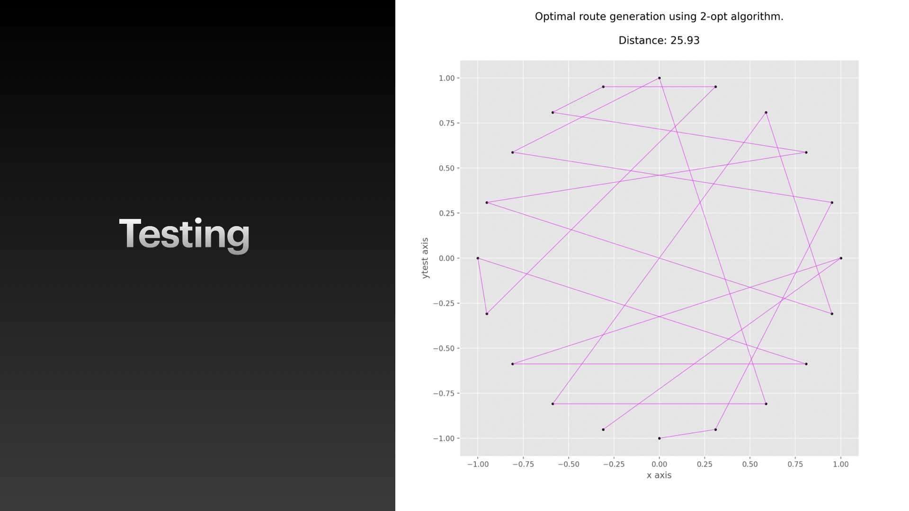
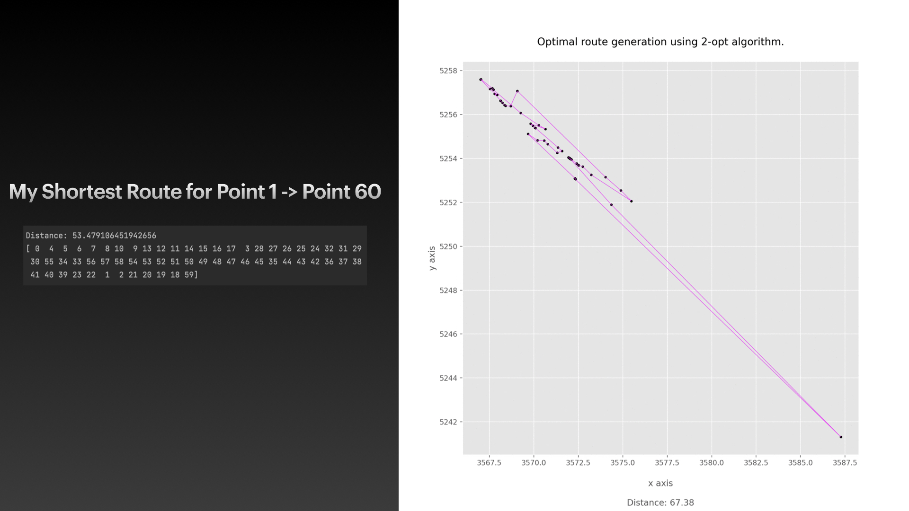

# Path Algorithm

This project was completed as part of a job application where I was given 
 

Interview Question
-------------------------------

Structure
-------------------------------

2-Opt Algorithm (<a href="https://en.wikipedia.org/wiki/2-opt">2-Opt Wiki/a>)
-------------------------------

Testing
-------------------------------

 
Solution
-------------------------------

