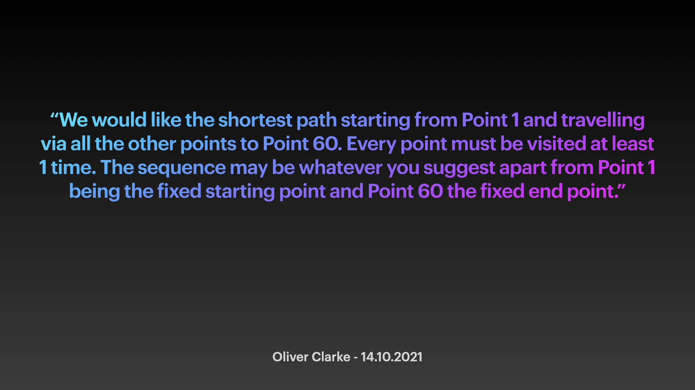
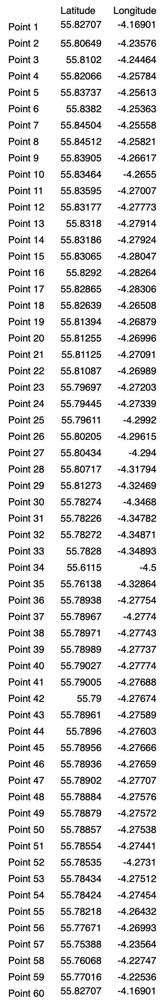
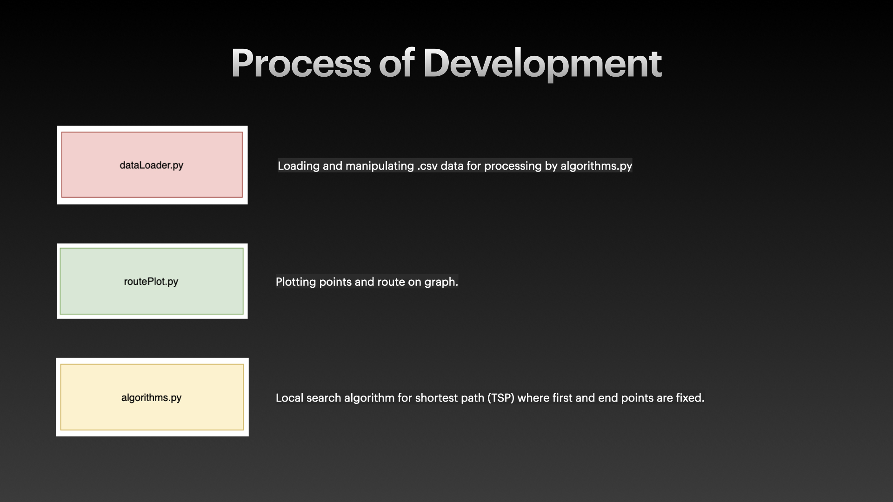
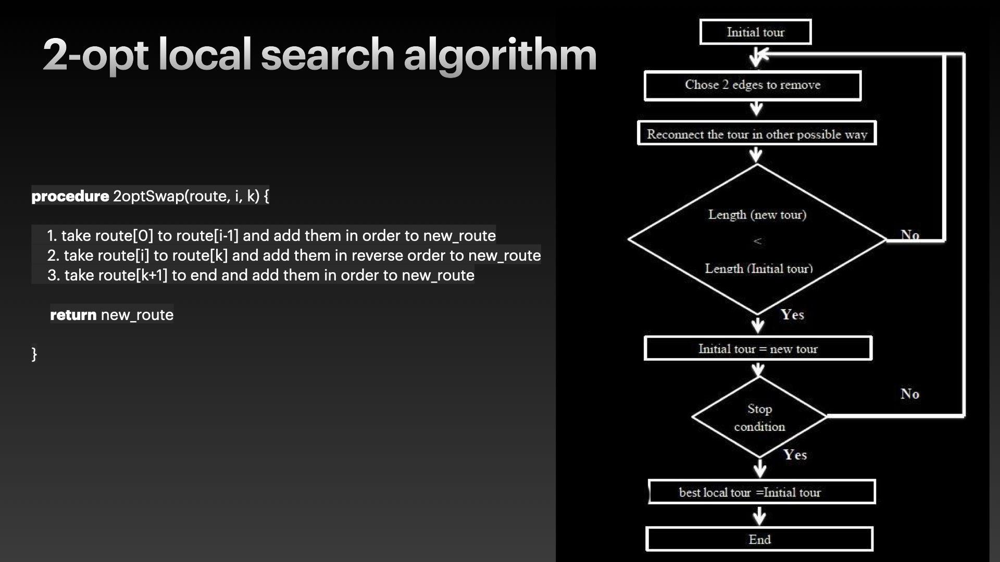
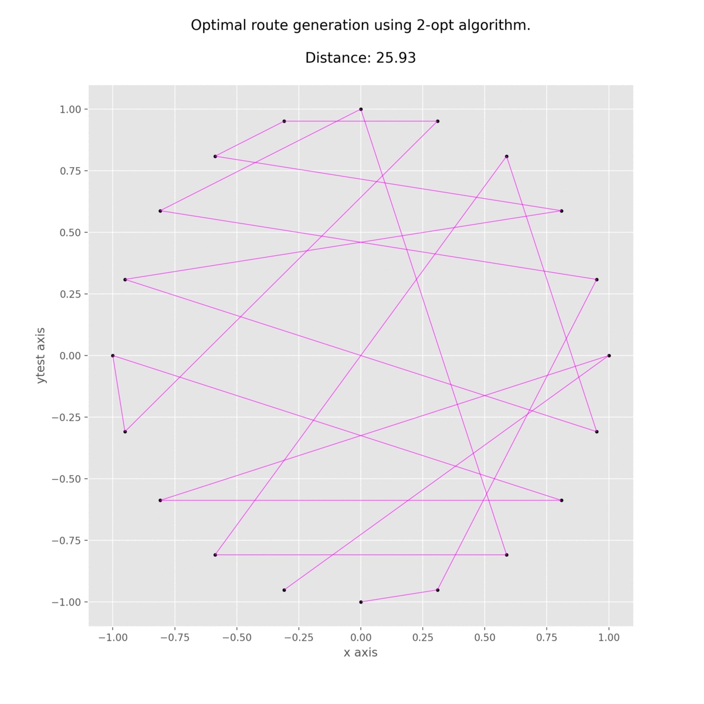
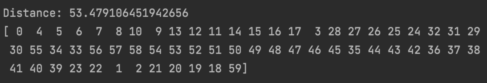
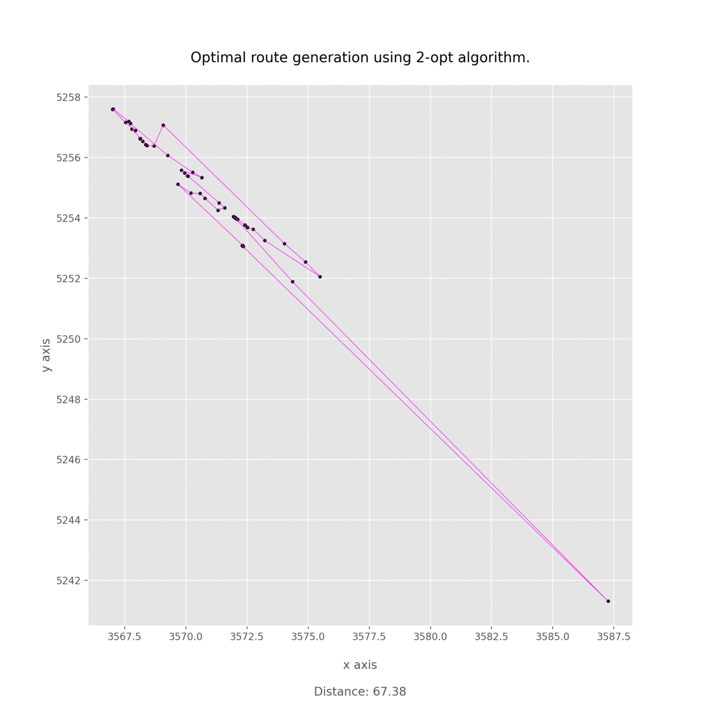

# Path Algorithm

This project was completed as part of a job application in Oct 2021
 

Interview Question
-------------------------------

The provided data:

Program Structure
-------------------------------

2-Opt Algorithm <a href="https://en.wikipedia.org/wiki/2-opt"> 2-Opt Wiki /a>
-------------------------------

Testing
-------------------------------

To test the algorithm I used a circle. A circle  was used because it is easy to visualise the algorithm working correcty, this is because the shortest path around a circle is its perimeter.

 
 
 
Solution
-------------------------------
 
The solution to the 60 points using the 2-opt algorithm in this python script:

 
 

 

